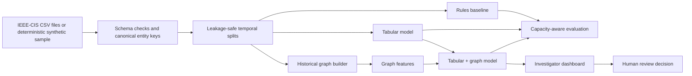

# Graph-Based Payment Fraud Ring Detection and Investigator Prioritization

An interview-ready data-science project that identifies suspicious relationships among payment transactions and helps an investigator decide which alerts to review first.

> **Scope and language:** Transaction labels indicate fraud at the transaction level. Connected groups are described only as **suspected fraud rings** because IEEE-CIS does not provide verified fraud-ring labels. The system recommends investigator review; it does not automate account blocking or make legal conclusions.

## Business problem

Transaction-only models can miss coordinated activity spread across cards, devices, addresses, email domains, customers, and recipients. This project combines conventional transaction features with graph signals to answer two questions:

1. How risky is this transaction?
2. Which connected suspicious activity should an investigator examine first, and why?

The core delivery is deliberately achievable in 10–12 focused days: a rules baseline, a tabular baseline, a leakage-safe graph-feature model, a fair comparison, and an investigator-facing Streamlit dashboard. GraphSAGE or GAT remains a stretch goal.

## Planned architecture



## Day 1 status

- [x] Independent local Git repository and project structure
- [x] Canonical transaction/entity schema and data dictionary
- [x] Deterministic synthetic generator with a deliberately connected suspicious pattern
- [x] IEEE-CIS ingestion adapter for `train_transaction.csv` and `train_identity.csv`
- [x] Chronological train/validation/test assignment with 24-hour purge gaps
- [x] Dataset manifest with row counts, fraud prevalence, split counts, and SHA-256 checksum
- [x] Focused tests for schema, deterministic generation, IEEE mapping, and temporal separation
- [ ] Rules and tabular baselines (Day 2)

## Repository layout

```text
graph-payment-fraud-detection/
├── configs/project.toml
├── data/{raw,interim,processed}/
├── docs/
│   ├── data_dictionary.md
│   └── validation_plan.md
├── scripts/prepare_data.py
├── src/fraud_detection/data/
├── tests/
├── .gitignore
├── pyproject.toml
└── README.md
```

## Quick start with synthetic data

Python 3.11 or newer is recommended.

```powershell
python -m venv .venv
.venv\Scripts\Activate.ps1
python -m pip install -e ".[dev]"
python scripts/prepare_data.py --mode synthetic
python -m pytest
```

The preparation command writes:

- `data/processed/transactions.csv` — canonical, chronologically ordered transactions with a split column;
- `data/processed/manifest.json` — provenance and validation summary.

All generated and raw data are ignored by Git.

## Add the real IEEE-CIS data later

1. Download the IEEE-CIS Fraud Detection competition data from Kaggle after accepting its terms.
2. Place these exact files in `data/raw/ieee-cis/`:
   - `train_transaction.csv`
   - `train_identity.csv`
3. Do **not** add either file to Git. Confirm with `git status --short`.
4. Prepare a development-sized, time-ordered slice:

```powershell
python scripts/prepare_data.py --mode ieee --max-rows 100000
```

5. When memory permits, omit `--max-rows` to prepare the full training data:

```powershell
python scripts/prepare_data.py --mode ieee
```

`TransactionDT` is retained as elapsed seconds from the dataset's undisclosed reference point. No calendar date is invented. The adapter derives stable, hashed entity keys from anonymized fields. IEEE-CIS has no explicit verified customer or payment-recipient identifier, so `customer_id` and `recipient_id` are documented proxies—not real identities.

## Validation and leakage controls

The default holdout is chronological: earliest 60% for training, next 20% for validation, latest 20% for test, with a 24-hour purge gap after each earlier period. Full details are in [the validation plan](docs/validation_plan.md).

The key graph rule is: a feature for transaction time *t* may use only relationships observed at or before *t*, and any label-derived feature may use only labels that would have been available before *t*. Validation and test labels never contribute to their own features. Entity identifiers, raw target aliases, post-outcome fields, and fitted encoders are excluded or fitted within the training boundary.

## Planned evaluation

Models will be compared on PR-AUC, precision and recall at a fixed investigation capacity, recall in the top 1% and 5% of alerts, false-positive rate, and alert-volume reduction versus the rules baseline. Thresholds are selected on validation data and reported once on the untouched test period.

## Reproducibility

- Project seed: `42`
- Configuration: `configs/project.toml`
- Dependencies and test settings: `pyproject.toml`
- Every prepared dataset receives a checksum and provenance manifest
- Coherent milestones are committed only after tests pass

## Limitations already known

- IEEE-CIS labels individual transactions, not fraud rings.
- Anonymized fields make customer and recipient nodes approximate.
- Shared entities can reflect legitimate households, offices, or infrastructure.
- The synthetic data proves the pipeline, not model performance.
- A useful risk score supports investigation; it is not evidence of criminal conduct.

## 10–12 day delivery plan

| Day | Outcome |
|---|---|
| 1 | Repository, schema, ingestion/sample pipeline, leakage-safe split, tests |
| 2 | Data quality report, rules baseline, tabular preprocessing and baseline |
| 3 | Entity-link graph construction and graph integrity tests |
| 4 | Causal structural graph features |
| 5 | Leakage-safe label-history features and graph-feature model |
| 6 | Capacity-aware evaluation and error analysis |
| 7 | Explainability and investigator reason codes |
| 8 | Streamlit investigation dashboard |
| 9 | Experiment report, model card, limitations and architecture polish |
| 10 | Interview presentation, demo script and end-to-end reproducibility check |
| 11–12 | Buffer; optional GraphSAGE/GAT only if the core is complete |

