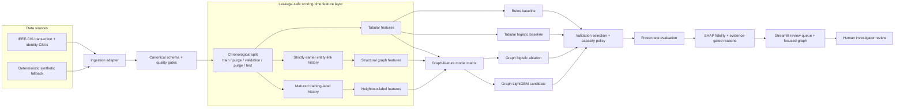
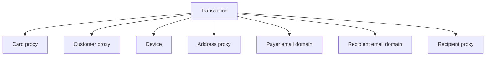
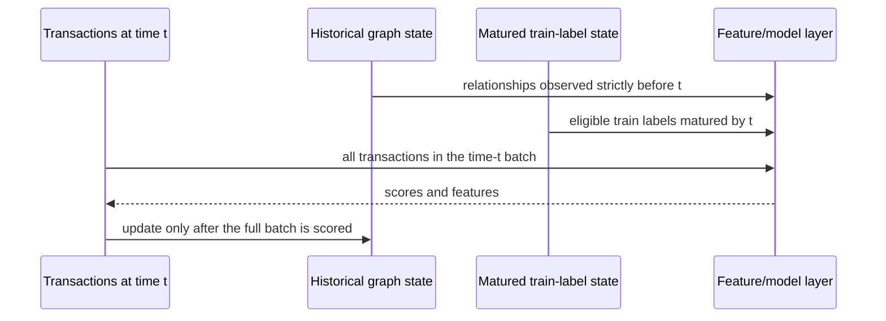

# System architecture and leakage boundaries

## Purpose

The system ranks payment transactions for investigator review by combining transaction attributes with historical relationship signals. It is an offline interview prototype with a local Streamlit interface. It does not make account decisions, identify people, or claim that a connected group is a verified criminal network.

## End-to-end architecture

The boxes inside the scoring-time layer obey event-time availability. The dashboard consumes an audited alert artifact rather than evaluation labels.

## Graph schema

Each transaction-to-entity edge means only that the field was observed on that transaction. It does not imply ownership, collusion, or wrongdoing. IEEE-CIS has no explicit customer or payment-recipient identifier, so some nodes are stable hashed proxies derived from anonymized fields.

Email domains participate in broad historical degree features but are excluded from specific-entity components and the investigator's focused connection view. This prevents common domains from dominating suspected fraud-ring structure.

## Event-time state transition

This same-time batching rule prevents one transaction from using another transaction with the identical event time as historical evidence. Structural features may use earlier unlabelled relationship observations from any split because those attributes would be known in a streaming system. Label-derived features are stricter: only matured training outcomes enter state; purge, validation, and test labels are ignored.

## Component responsibilities

| Component | Responsibility | Leakage control |
|---|---|---|
| Ingestion | Map IEEE-CIS or synthetic records to the canonical schema | No invented calendar dates; raw target has one canonical name |
| Temporal split | Create train, validation, test and purge periods | Chronological order and 24-hour separation |
| Rules/tabular baselines | Establish non-graph comparison points | Thresholds, encoders and scalers fitted on train only |
| Structural graph builder | Track historical entity relationships | Score a complete time batch before updating state |
| Matured-label builder | Summarize resolved fraud-labelled neighbours | Training labels only, with a 24-hour maturity delay |
| Model selection | Choose the candidate for explanation | Validation PR-AUC only; frozen test is not used to switch models |
| Explainability | Produce local reasons tied to model contributions | Exact Tree SHAP fidelity check and evidence gates |
| Dashboard | Present a capacity-limited queue and local connections | Evaluation labels removed; entities masked; earlier neighbours only |
| Investigator | Review additional context and decide next action | Human review is mandatory; no automatic blocking |

## Reproducibility and deployment boundary

Configuration and random seeds are versioned, generated data and model artifacts are ignored, and scripts rebuild each milestone. The local architecture is deliberately simple enough for a 10-day project. It is not represented as production-ready.

A production design would add a feature store or event-state service, model registry, authenticated case-management integration, access controls, audit logging, monitoring, encryption, retention rules, and approved operational procedures. Those are design recommendations, not implemented capabilities or regulatory claims.
